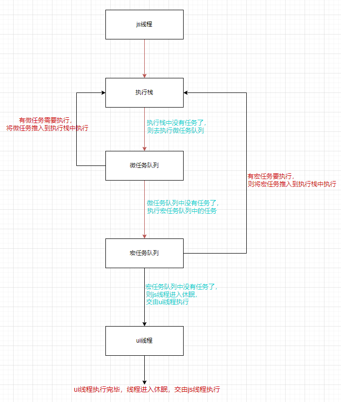

## 1. JavaScript事件循环

> JavaScript是一个单线程、非堵塞的脚本语言。单线程就意味着JavaScript在任何时候，都只能同时执行一个任务，如果执行的是一个需要等待返回结果的任务，那么就会造成堵塞（线程会等待结果返回再继续执行）。
>
> 单线程在执行需要等待的任务的时候，会造成堵塞，那么JavaScript是如何做到单线程不堵塞的呢？JavaScript是运行在浏览器上的，虽然js是单线程，但是浏览器不是啊。
>
> *对于一些需要等待结果的任务，js都会将它们交给浏览器对应的线程去处理，等待有了结果了，对应的处理线程会将回调推入到事件队列中。js在执行完所有的同步任务后，就会去事件队列中获取回调，并将回调放入到执行栈中执行。*

## 2. 执行栈

> *执行栈是一个后进先出的数据结构*，执行栈中存储的元素是执行上下文对象，所有要执行的函数，都会先进行预编译，生成对应的函数执行上下文对象，然后将执行上下文对象推入到执行栈中执行，函数执行完成后，将函数的执行上下文对象从执行栈中移除。

- js代码在执行之前，会先调用预编译器对全局代码进行预编译，生成全局执行上下文对象，然后将执行上下文对象推入到执行栈中去执行。
- 在执行全局代码的时候，如果遇到了要执行函数，也会去调用预编译器去对函数进行预编译，生成函数的执行上下文对象，然后将函数执行上下文对象推入到执行栈中执行。
- 在执行函数的时候，如果又在函数内部遇到要执行的函数，则会和上面一样，对函数进行预编译，生成函数的执行上下文对象，推入到执行栈中执行。
- 当函数执行完后，就会将函数从执行栈中移除，然后继续执行执行栈中的其他函数。
- 最后，所有的代码都执行完毕，执行栈中只剩下全局执行上下文对象。（*注意：全局执行上下文对象在代码执行完毕后并不会出栈，只有当页面关闭的时候才会出栈*。）

## 3. JavaScript中的异步任务

> 对于一些异步任务，比如ajax，Dom事件，定时器等等，js中不会去处理这些异步任务的，而是将这些任务交给浏览器中对应的线程去处理。在异步任务有了结果后，对应的线程会将异步任务的回调函数推入到事件队列中去等待js主线程执行。

**例如：**

​	js代码在执行的时候，遇到了一个`ajax`任务，js就会把这`ajax`任务交由对应的`ajax线程`去处理，然后js会去继续执行执行栈中的其他任务。

​	`ajax线程`在等到结果后，就会将对应的回调放入到事件队列中。js主线程在执行完执行栈中的所有任务后，（执行栈中只有一个全局执行上下文）就会去事件队列查找，如果事件对象中有回调函数，就将回调函数推入到执行栈中去执行。

## 4. 事件循环

- 对于一些异步任务，比如ajax，Dom事件，定时器等等。js中不会去处理这些异步任务的，而是将这些任务交给浏览器中对应的线程去处理。在异步任务有了结果后，对应的线程会将异步任务的回调函数推入到事件队列中去等待js执行。
- js在将任务委托给浏览器后，自己则会继续去执行执行栈中的同步任务，在所有的同步任务执行完成后，就会从事件队列中获取回调函数，然后将回调函数推入到执行栈中执行。
- 执行栈的任务执行完成后，又会去事件队列中获取要执行的回调。
- 重复这一过程，直到没有任务要执行，js线程就会进入休眠，将控制器交给ui线程去执行任务。
- 当ui线程执行完成后，也会进入休眠，将控制权从新交给js线程去执行。
- 会一直重复这个过程形成一个循环。即*事件循环*。

## 微任务和宏任务

- 执行栈：
  - 后进先出。
- 事件队列：（先进先出）
  - 微任务（micro task）：new Promise()、Object.observe、MurtationObserver
  - 宏任务（macro task）：setInterval()、setTimeout()、dom事件、I/O、UI rendering、requestAnimationFrame
  - 先执行微任务中的回调，只有微任务中的所有回调都被执行完成后，才会去执行宏任务队列中的回调。

- 执行栈中的任务执行完毕后，就会去微任务队列中执行微任务：
  - 有微任务要执行，将微任务推入执行栈中，然后去执行栈的执行该任务。执行完成后，继续去微任务队列中，执行微任务，只有当微任务队列中没有任务要执行，才会去执行宏任务队列中的任务。
  - 没有微任务要执行，去执行宏任务中的宏任务：
    - 有宏任务执行，将宏任务推入到执行栈中执行，宏任务执行完毕后，会继续去微任务中查找是否有微任务要执行，如果有则执行微任务，没有则执行宏任务。
    - 没有宏任务执行，则主线程进入休眠，将控制权交给ui线程执行。
  - ui线程在执行完成后，也会进行休眠，将控制器从新交给js线程
  - 这样就形参了一个循环。即*事件循环*。

- 执行执行栈中的任务 ==》执行微任务==》执行宏任务==》js线程休眠，执行ui线程==》ui线程执行完成休眠继续执行js线程。

**图解事件循环：**

