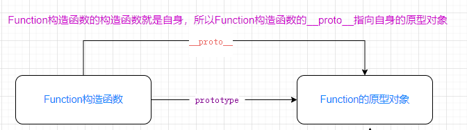

## 1.什么原型对象？

> 每个函数在创建的时候，都会生成一个属性`prototype`，这个属性指向一个对象，这个对象就是此函数的`原型对象`。
>
> 每个实例对象都有一个`__proto__`属性(又叫隐式原型属性)，指向它构造函数的原型对象。
>
> 原型对象的作用就是用来实现继承，通过原型链实现原型继承。

在函数的原型对象上添加属性

```js
function Person() {
}
//原型对象上添加属性
Person.prototype.x = 30;
Person.prototype.y = 40;
```

实例对象继承原型对象

```js
const person = new Person();
console.log(person.x);
console.log(person.y);
console.log(person.__proto__ === Person.prototype);//true;
```

​	上面通过 new Person()创建了一个实例对象，这个实例对象有一个`__proto__`指向它构造函数的原型对象，这样就完成了原型继承。


**图解原型继承：**


函数也是一个对象，函数也有一个`__proto__`属性指向它的构造函数。

函数的构造函数是`Function`构造函数，所有的函数都是通过`new Function()`创建的。

**图解函数的原型关系**


函数都有一个`__proto__`属性指向它的构造函数，那么Function的构造函数是谁？

答：Function构造函数的构造函数就是自己，所以Function构造函数的`__proto__`指向自身的原型对象

**图解Function的原型关系**




是函数就会有`prototype`属性指向函数的原型对象，和`__proto__`指向它构造函数的原型对象。是对象就会有`__proto__`指向它构造函数的原型对象，那么原型对象的也该有一个`__proto__`指向它的构造函数，那原型对象的构造函数是谁？

答：原型对象的构造函数时`Object`构造函数，所以原型对象都有一个`__proto__`属性，指向于Object构造函数的原型对象。

**原型对象的`__proto__`**


​	所有的函数都是`Function`构造函数的实例，Object也不例外，所以Object也有一个`__proto__`指向于Function构造函数的*原型对象*。并且Object的原型对象的`__proto__`的值是null，所以Object的原型对象就是原型链的尽头。

**最终一个完整的关系图**


## 原型链

> **原型链又叫隐式原型链，原型链的作用是用来查找对象的属性的**，如果一个属性在当前的对象上没有找到就会沿着`__proto__`一直查找，直到`__proto__`的值为null，还是找不到则返回undefined。
>
> 原型链的作用：1.实现原型继承 2. 通过原型链查找属性。

**Perosn实例的原型链：**


## 总结：

- 原型是一个对象，每个函数都有一个`prototype`属性，指向函数的*原型对象*。
- 每个对象都有一个`__proto__`属性，指向对象的构造函数的原型对象。
- 原型的作用是用来实现原型继承。即：对象的`__proto__` = 函数的原型对象。
- **原型链又叫隐式原型链，原型链的作用是用来查找对象的属性的**，如果一个属性在当前的对象上没有找到就会沿着`__proto__`一直查找，直到`__proto__`的值为null，还是找不到则返回undefined。
- 原型链的作用：1.实现原型继承 2. 通过原型链查找属性。


